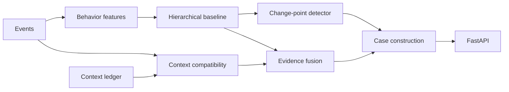

# Fable

Fable is a transparent behavioral-transition detection backend for insider-risk
investigation. It compares identity activity with personal and peer baselines,
detects behavioral change points, checks each event against approved business
context, and returns evidence without making an accusation.

Built with FastAPI, SQLAlchemy, Pydantic, and SQLite for a hackathon demonstration.
There is no LLM in the detection or scoring path.

## What Fable returns

Every case retains three separate values:

- `raw_deviation` — deviation before legitimate context is considered.
- `context_coverage` — the fraction of raw risk removed by matching context.
- `residual_risk` — risk remaining after context is applied.

Scores and event explanations are recomputed from stored events and context-ledger
entries when cases are fetched. They are not fixed per demo actor.

## Highlights

- Multi-window behavioral features over 15 minutes, 24 hours, 7 days, and 30 days.
- Hierarchical personal, role-cohort, and resource-rarity baselines.
- Page-Hinkley change-point detection with a persisted latch and re-arm state.
- Per-event context classification:
  `explained`, `partially_explained`, `unexplained`, or `indeterminate`.
- Severity-weighted evidence fusion with inspectable, manually configured weights.
- Counterfactual scoring by recomputing risk with one factor removed.
- Analyst feedback, case workflow states, and automatic reopening for new events
  outside a previously matched grant.
- A shift-map graph response for frontend visualization.
- Explicit temporal boundaries to prevent future events influencing earlier results.
- Neutral-language validation for generated case explanations.

## Architecture



```text
.
├── api/
│   └── routes.py          # REST endpoints
├── engine/
│   ├── behavior.py        # Multi-window feature computation
│   ├── baseline.py        # Hierarchical baseline and deviations
│   ├── changepoint.py     # Page-Hinkley detector and latch
│   ├── context.py         # Per-event context matching
│   ├── fusion.py          # Three-number risk calculation
│   ├── case_builder.py    # Cases, ranking, feedback, and shift map
│   └── narrative.py       # Neutral-language validation
├── models/                # SQLAlchemy models, API schemas, and enums
├── seed/                  # Demo scenarios and seed CLI
├── tests/                 # Detector, temporal, context, and API tests
├── API_CONTRACT.md        # Verified frontend integration contract
├── config.py              # Detector parameters and fusion weights
├── database.py            # SQLite engine and additive migrations
├── main.py                # FastAPI application
└── requirements.txt
```

## Quick start

### 1. Create a virtual environment

```bash
python -m venv .venv
```

Activate it on Windows PowerShell:

```powershell
.\.venv\Scripts\Activate.ps1
```

Or on macOS/Linux:

```bash
source .venv/bin/activate
```

### 2. Install dependencies

```bash
pip install -r requirements.txt
```

### 3. Start the API

```bash
python -m uvicorn main:app --host 127.0.0.1 --port 8000
```

The application creates or migrates `fable.db` automatically. An empty database is
seeded on startup.

- API: <http://127.0.0.1:8000>
- Swagger UI: <http://127.0.0.1:8000/docs>
- ReDoc: <http://127.0.0.1:8000/redoc>
- OpenAPI JSON: <http://127.0.0.1:8000/openapi.json>

## Demo scenarios

After a clean reseed, the current demo data produces:

| Actor | Scenario | Raw deviation | Context coverage | Residual risk | Data quality |
|---|---|---:|---:|---:|---|
| Priya | Approved Engineering → Security role transition | `38.1386` | `0.9915` | `0.3225` | `sufficient` |
| Devraj Malhotra | Established account with no matching context | `98.4043` | `0.0000` | `98.4043` | `sufficient` |
| Arjun | Migration work explained; separate finance activity unexplained | `85.5876` | `0.5081` | `42.1029` | `sufficient` |
| Neha (New Hire) | Less than 14 days of history | `12.5638` | `0.0000` | `12.5638` | `sparse` |

Neha's case deliberately contains three `indeterminate` events to demonstrate how
the system represents insufficient information separately from unexplained behavior.

Reset the database to this state at any time:

```bash
curl -X POST http://127.0.0.1:8000/admin/reseed
```

This endpoint is intended for local demonstration and deletes current demo records.

## API quick reference

| Method | Path | Purpose |
|---|---|---|
| `GET` | `/health` | Service health |
| `POST` | `/admin/reseed` | Reset demo data |
| `GET` | `/entities` | List entities |
| `GET` | `/entities/{entity_id}` | Fetch one entity and detector regime state |
| `GET` | `/entities/{entity_id}/events` | List an entity's events |
| `POST` | `/entities/{entity_id}/events` | Ingest an event |
| `GET` | `/entities/{entity_id}/context` | List context entries |
| `POST` | `/entities/{entity_id}/context` | Create or update context |
| `GET` | `/cases` | List and rank active cases |
| `GET` | `/cases/{case_id}` | Fetch live-recomputed case detail |
| `GET` | `/cases/{case_id}/counterfactual` | Recompute risk with each factor removed |
| `POST` | `/cases/{case_id}/feedback` | Submit an analyst verdict |
| `GET` | `/cases/{case_id}/shift-map-data` | Fetch visualization graph data |

See [API_CONTRACT.md](API_CONTRACT.md) for verified request bodies, real responses,
status codes, enums, CORS behavior, and a frontend field reference.

## Live context-edit demonstration

Arjun starts with context for `migration-repo`, while his `finance-archive` events
remain unexplained. Fetch his case:

```bash
curl http://127.0.0.1:8000/cases/3
```

Expand context through the API:

```bash
curl -X POST http://127.0.0.1:8000/entities/12/context \
  -H "Content-Type: application/json" \
  -d '{
    "id": 2,
    "reason": "project",
    "valid_from": "2026-08-26T09:00:00Z",
    "valid_until": "2026-09-15T09:00:00Z",
    "allowed_resources": ["migration-repo", "finance-archive"],
    "allowed_actions": ["login", "repo_access", "file_access", "file_download", "external_upload"],
    "approved_destinations": ["s3://corp-migration-backup", "https://personal-cloud.example/upload"],
    "approved_by": "eng-manager"
  }'
```

Fetch the case again. The verified result is:

```text
residual_risk:    42.1029 → 3.0220
context_coverage:  0.5081 → 0.9647
raw_deviation:    85.5876 → 85.5876
```

The raw value remains unchanged because raw deviation deliberately excludes context.

## Run tests

```bash
python -m pytest -q
```

The suite covers:

- Page-Hinkley detection, latching, re-arming, and flat-series behavior.
- Indeterminate classification and sparse data quality.
- Neutral-language enforcement.
- Temporal-causality protection.
- Auto-reopening resolved cases.
- API context edits and counterfactual recomputation.

Additional executable checks:

```bash
python -m tests.test_context_edit
python -m tests.smoke_api
```

These scripts reseed the local database.

## Scoring model

The fusion layer uses manually configured weights from `config.py`:

```text
linear = W_S·S_t + W_P·P_t + W_Q·Q_t + W_A·A_t + W_I·I_t - W_C·C_t
```

Where:

- `S_t` — personal-baseline deviation.
- `P_t` — peer/cohort deviation.
- `Q_t` — behavioral sequence strength.
- `A_t` — asset sensitivity.
- `I_t` — identity/privilege signal.
- `C_t` — matching legitimate context, applied subtractively.

The linear result is transformed to a bounded 0–100 value. The weights are
inspectable and are not learned from the named scenarios.

## Current scope

- REST API only; the frontend is maintained separately.
- SQLite persistence for local demonstration.
- CORS currently accepts all origins.
- No authentication or authorization is implemented.
- Collection endpoints are not paginated.
- `/admin/reseed` is a development-only destructive endpoint.
- Analyst feedback adjusts a stored per-role ranking threshold; it does not retrain a
  model.

## Design principles

- No hardcoded final risk or explanation outcome per actor.
- No LLM in detection, scoring, or context classification.
- Deterministic ordering and calculations.
- No future event may influence an earlier `as_of` evaluation.
- Indeterminate evidence is tracked separately rather than treated as explained or
  unexplained.
- Generated case text describes evidence and avoids verdict language.
